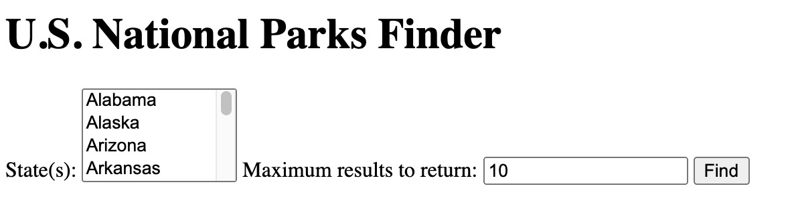
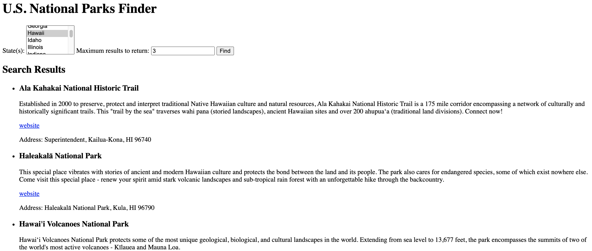

# National Parks

Practice assignment for working with APIs.

## Live Demo

[Live Demo](https://7424243.github.io/national-parks/)

## Screenshots

### Search Section

### Results Section

## Summary

This was a practice assignment for Thinkful. The purpose was to gain more experience working with APIs. This app allows the user to select the state they want to search in and how many search results they would like back. The results display the name of the national park, a link to the website, and other helpful information.

## Built With

* HTML
* CSS
* JavaScript
* jQuery
